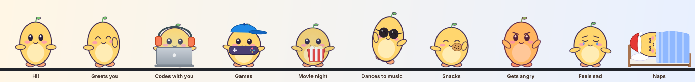

<div align="center">
    
    <h1 align="center">WindowPet: Custom Avatar Edition</h1>
    <p align="center">
        A desktop companion that lives on your Windows taskbar. One picture becomes a fully
        animated character that blinks, waves, codes with you, dances to your music, naps when
        you're away, reminds you to drink water, and gets grumpy if you throw it.
    </p>
    <a href="https://github.com/Dm-1324/WindowPet/releases/latest">
        
    </a>
    
    <a href="./LICENSE.md"></a>
</div>

<br>



🎬 **[Watch the 45-second launch video](./docs/launch-video.mp4)**

## ✨ What it does

**A living avatar from a single image**
- Your picture is turned into 300+ animation frames at startup: breathing, walking, hopping, climbing walls, hanging from the ceiling, dangling when dragged
- Blinks, looks at your cursor (eyes move left/right/up), waves its arms, steps with its feet
- Rounded speech bubbles with time-of-day greetings ("Good morning!")

**Activities and moods**
- Sleeps in a bed, works on a laptop, plays with a controller, watches movies with popcorn, sits, dances, spins
- Moods: angry (red face, stomping), emotional (teary eyes), attention-seeking (hops and waves)
- **Pet it** (rub the cursor back and forth over it) or **feed it** a snack to cheer it up; a ❤️ meter shows how close it is to feeling better

**Knows what you're doing**
- Codes with you in IntelliJ / VS Code, watches YouTube / Netflix with you, games with you
- Dances when music plays (Spotify, YouTube Music, songs on YouTube) and announces the song
- Naps when you're away from the keyboard and says "Welcome back! You were away 25 min"
- Follows your cursor around the screen

**Reacts to your PC**
- 🪫 Sleepy and yawning on low battery (warns at 20 %, 10 %, 5 %), ⚡ happy when you plug in, "fully charged!" at 100 %
- 🥵 Sweats and fans itself when the CPU or RAM is maxed out, "phew" when it cools down
- 📡 Holds an unplugged cable when the internet drops, celebrates when it's back
- 🔒 Guards your laptop when you lock it, "You're back! I kept your laptop safe" when you unlock
- ☔ Dresses for the weather in your city: umbrella in the rain, shades in the sun, a beanie when it's cold
- 🖼️ Lock screen picture: your pet in its outfit with lines like *"Laptop's locked 🔒 Unlock to chat with me!"* (starry night version after 10 pm)

**Actually useful**
- 🍅 Focus timer (Pomodoro) with a countdown above its head and break reminders
- Wellbeing nudges: drink water, stretch, eye breaks (paused while you're away or focusing)
- Reminders you set in Settings, delivered by the pet until you click it

**Make it yours**
- 👕 Wardrobe: hats, glasses, headphones, t-shirts with prints; Santa hat in December, party hat on your birthday
- Turn every feature on/off and choose how chatty it is (Settings → Companion)
- All 45+ original WindowPet characters are still available in the Pet Shop

## ⌨️ Keyboard shortcuts

Work from any app. Pressing a mode's key again turns it off.

| Keys | Action | Keys | Action |
|---|---|---|---|
| `Ctrl+Alt+S` | Sleep mode | `Ctrl+Alt+A` | Angry mood |
| `Ctrl+Alt+W` | Work mode (laptop) | `Ctrl+Alt+E` | Emotional (sad) mood |
| `Ctrl+Alt+G` | Gaming time | `Ctrl+Alt+T` | Attention-seeking mood |
| `Ctrl+Alt+M` | Movie night | `Ctrl+Alt+C` | Give a snack 🍪 |
| `Ctrl+Alt+D` | Dance | `Ctrl+Alt+F` | Follow the cursor on/off |
| `Ctrl+Alt+H` | Say hi | `Ctrl+Alt+P` | Focus timer start/stop |
| `Ctrl+Alt+N` | Back to normal | | |

## 📥 Install

1. Download `WindowPet_x.y.z_x64-setup.exe` from the [latest release](https://github.com/Dm-1324/WindowPet/releases/latest)
2. Run it (no admin rights needed). If Windows says *"Windows protected your PC"*, click **More info → Run anyway**. The app isn't code-signed.
3. Open **WindowPet** → **Pet Shop** → add **My Avatar**
4. Turn on **Settings → Auto start-up** to have it on every boot

Requires Windows 10 or 11 (64-bit).

## 🎨 Use your own character

The avatar is defined in [`src/config/my_avatar.json`](./src/config/my_avatar.json) and drawn from images in `public/media/`.

- **Picture**: replace `public/media/my_avatar.png`. A PNG with a transparent background works best; a plain background is removed automatically.
- **Blinking & expressions** (optional): set `eyes` to the centre and size of each eye, in pixels of your image.
- **Moving arms and feet** (optional): cut them into separate PNGs and list them under `parts` with the joint position (`pivotX`, `pivotY`).
- **Personality**: greetings, how often each activity happens, durations, shortcut keys, which apps count as coding / movies / games, focus timer lengths and nudge intervals are all in the same file.

Without `eyes` and `parts` it still works: the whole picture moves as one piece.

## 🛠️ Build from source

Prerequisites: [Node.js](https://nodejs.org) 20+, [Rust](https://rustup.rs), and on Windows the *Desktop development with C++* workload from Visual Studio Build Tools ([details](https://tauri.app/v1/guides/getting-started/prerequisites)).

```bash
git clone https://github.com/Dm-1324/WindowPet.git
cd WindowPet
npm install
npm run tauri dev      # run with live reload
npm run tauri build    # build the installer -> src-tauri/target/release/bundle/
```

The launch video lives in [`launch-video/`](./launch-video) (made with Remotion).

Releases are built by GitHub Actions: **Actions → Build Windows installer → Run workflow** creates a release for the version in `src-tauri/tauri.conf.json`.

### How it works

| Part | Where |
|---|---|
| Avatar frame generator (poses, eyes, limbs, props, outfits) | `src/scenes/avatar.ts` |
| Pet behaviour, moods, reactions, companion features | `src/scenes/Pets.ts` |
| Idle time, foreground app and "now playing" (Windows APIs) | `src-tauri/src/app/system.rs` |
| Settings tabs: Wardrobe, Reminders, Companion | `src/ui/setting_tabs/` |
| Shared settings and app/music detection | `src/utils/companion.ts` |

Built with [Tauri](https://tauri.app), React, [Phaser](https://phaser.io) and [Mantine](https://mantine.dev). Everything runs locally: app and media detection never leave your computer.

## 🙏 Credits

This is a fork of [**WindowPet**](https://github.com/SeakMengs/WindowPet) by [Seakmeng](https://github.com/SeakMengs), which provides the original app, the pet engine and the 45+ characters in the Pet Shop. If you like the original, you can [buy them a coffee](https://www.buymeacoffee.com/seakmeng).

Inspired by [vscode-pets](https://marketplace.visualstudio.com/items?itemName=tonybaloney.vscode-pets), [Shimeji-ee](https://kilkakon.com/shimeji/) and [DPET](https://store.steampowered.com/app/1980920/DPET__Desktop_Pet_Engine/).

## 📄 License

MIT License. Copyright (c) 2023 Seakmeng. See [LICENSE.md](./LICENSE.md).
